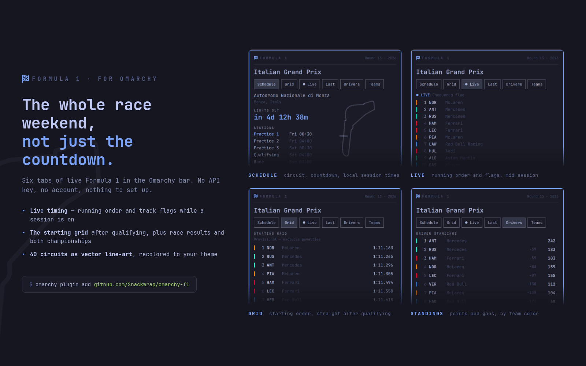

# Formula 1 — Omarchy bar plugin



A checkered-flag pill for the [Omarchy](https://omarchy.org) (Quattro) bar. It
counts down to the next Formula 1 session — and behind it is the rest of the
weekend: the live timing tower while a session is running, the starting grid the
moment qualifying ends, the last race's results, both championships, and the
circuit itself drawn as vector line-art in your theme's colors.

No API key, no account, nothing to set up before it works.

## The six tabs

- **Schedule** — the circuit outline drawn as a theme-colored line-art hero,
  the countdown, and the full weekend session schedule (practice, sprint,
  qualifying, race) in your **local time**.
- **Grid** — appears once qualifying is done and before the race starts: the
  provisional starting order with every lap time, and it becomes the default
  tab during that window.
- **Live** — during a session, the running order (leader, positions, team
  colors) and track-flag status from the OpenF1 API. The pill picks up a LIVE
  indicator and the tab auto-opens. Polled only while a session is actually on.
- **Last** — the most recent race result: finishing order, gaps and status,
  points.
- **Drivers** / **Teams** — driver and constructor championship standings, with
  team-color chips, podium emphasis, and points-behind-leader gaps.

Any row in the grid, results and standings tabs opens that driver, team or race
on Wikipedia.

12/24-hour time, what the bar counts down to, which tab opens first, a favorite
driver and team to highlight, and an optional pre-race notification are all
configurable — see [Settings](#settings) below.

Data comes from the free [Jolpica-F1 API](https://github.com/jolpica/jolpica-f1)
(an Ergast-compatible mirror) and [OpenF1](https://openf1.org) for live timing.
Neither needs a key. Circuit outlines are bundled from
[`bacinger/f1-circuits`](https://github.com/bacinger/f1-circuits) (MIT),
preprocessed into a `tracks.js` module by `tools/build-tracks.py` and drawn as
vector paths via QtQuick.Shapes — so they recolor to match your Omarchy theme.

## Requirements

- Omarchy **Quattro (v4)** with `omarchy-shell` (Quickshell-based bar)
- `curl` on `PATH`
- A Nerd Font in the bar (Omarchy ships one) for the checkered-flag glyph

## Install

```bash
omarchy plugin add https://github.com/Snackwrap/omarchy-f1.git --enable
omarchy bar move com.leafbox.f1 right
```

## Local development

Fork the repo and check out your copy, then from inside it:

```bash
./deploy-local.sh                     # symlink into ~/.config/omarchy/plugins + validate
omarchy plugin enable com.leafbox.f1 right
omarchy restart shell                 # reload after each edit (rescanPlugins alone
                                      # won't reload changed QML — the shell caches it)
```

The Grid and Live tabs only have anything to show on a race weekend, which makes
them awkward to work on. `omarchy bar set com.leafbox.f1 debugForceTabs true`
renders both from the last race's data, and with it on `defaultTab` may name any
tab (`schedule`, `grid`, `live`, `results`, `drivers`, `constructors`) and stays
pinned there — which is how `tools/capture-preview.sh` shoots every tab.

## Uninstall

```bash
omarchy plugin disable com.leafbox.f1
omarchy plugin remove com.leafbox.f1
omarchy restart shell
```

## Settings

Omarchy has no settings UI for bar widgets yet — the manifest declares a schema
for the one that is coming. Until then, set any key from the table below with:

```bash
omarchy bar set com.leafbox.f1 favoriteDriver VER
omarchy restart shell
```

An empty value falls back to the default, so `omarchy bar set com.leafbox.f1
favoriteDriver ""` clears the highlight.

| Setting | Key | Does |
|---|---|---|
| Time format | `timeFormat` | `24h` or `12h` |
| Bar countdown target | `countdownTarget` | `race` or the next `session` |
| Default tab | `defaultTab` | `schedule`, `drivers` or `constructors` |
| Show team colors | `teamColors` | Team-color chips on standings rows |
| Animated intro | `raceAnimations` | The circuit flip-in and start lights, below |
| Highlight driver | `favoriteDriver` | 3-letter code, e.g. `VER` |
| Highlight team | `favoriteTeam` | Constructor id, e.g. `ferrari` |
| Notify before race | `notifyRace` | Off by default |
| Notify lead time | `notifyLeadMin` | Minutes before lights out, 0-120 |
| Popup position | `popupPosition` | `icon` (under the bar icon) or `center` |

### The intro

Opening the Schedule tab flips the circuit outline up out of the horizon into
plan view — a one-shot Mode 7 tilt, the perspective trick 16-bit racers used for
their ground plane. It is one-shot rather than a loop because the popup is only
open for a few seconds, and because the plan view is the orientation that makes
a circuit recognisable.

On race day — from three hours before lights out — the starting gantry appears
beside the countdown and runs the five-light sequence. Before the start it holds
on all five reds, which is the real moment on the grid. Once the race is
running it finishes the way the real one does, going dark, because lights out
*is* the start.

Both are off with a single setting (**Animated intro**) for anyone who wants the
panel to sit still.

## Interaction

| Action | Result |
|---|---|
| Left click | Toggle the popup |
| Middle click | Force a data refresh |
| During a live session | The bar flag turns the theme accent color; the tooltip shows the leader/flag |

## How it works

- `BarWidget.qml` — the bar-slot button + popout-identity shim.
- `Panel.qml` — fetches `current/next.json` via `curl` (Quickshell `Process`),
  parses it, exposes `label`/`tooltip` to the pill, and renders the popup. A
  1-second timer advances the countdown; the schedule refetches every 6 hours.
- `TrackMap.qml` — the circuit outline, and the Mode 7 matrix that flips it in.
- `StartLights.qml` — the five-light starting gantry and its sequence.
- `tools/capture-preview.sh` + `tools/build-preview.sh` — regenerate the listing
  card. The popup closes the moment you click a terminal, so the capture is
  driven over IPC and cropped by diffing the screen with the popup open against
  the same screen with it closed.

## License

MIT (this plugin).

Bundled circuit geometry in `tracks.js` is derived from
[`bacinger/f1-circuits`](https://github.com/bacinger/f1-circuits),
Copyright (c) Tomo Bacinger, MIT License. Schedule/standings/results data © the
[Jolpica-F1](https://github.com/jolpica/jolpica-f1) project (Ergast-compatible
API); live timing © [OpenF1](https://openf1.org). No API keys required.

This is an unofficial fan project. It is not associated with, endorsed by, or a
product of Formula 1. F1, FORMULA 1 and the related marks are trademarks of
Formula One Licensing BV; this plugin uses none of the official logos or marks
and draws its own lettering for the panel masthead. Neither Formula One,
Jolpica, OpenF1 nor Tomo Bacinger endorses it.
